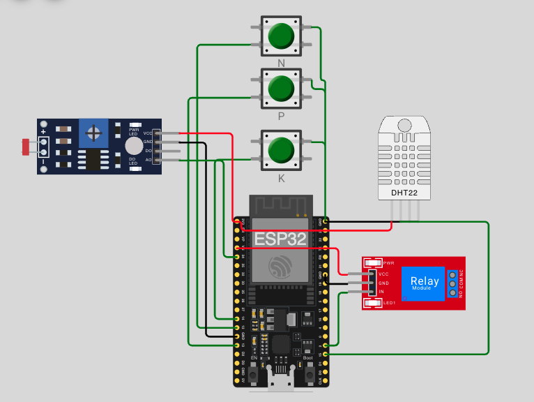

# FIAP - Faculdade de Informática e Administração Paulista

<p align="center">
  <a href="https://www.fiap.com.br/">
    
  </a>
</p>

---

# Sistema Inteligente de Irrigação e Fertirrigação

## Grupo Batch Size 5

## 👨‍🎓 Integrantes:
- <a href="https://www.linkedin.com/in/beatriz-barreto-pinto-btrz">Beatriz Moreira Barreto Pinto</a>
- <a href="https://www.linkedin.com/in/gustoliver-caldas-7a9a33350">Gustavo de Oliveira Caldas</a>
- <a href="https://www.linkedin.com/in/jfnalves">João Felipe das Neves Alves</a>
- <a href="https://www.linkedin.com/in/paulocbarreto">Paulo Oliveira</a>
- <a href="https://www.linkedin.com/in/tamiresvferreiras/">Tamires Ferreira</a>

## 👩‍🏫 Professores:
### Tutor(a)
- <a href="https://www.linkedin.com/in/nicollycrsouza">Nicolly Candida Rodrigues de Souza</a>

### Coordenador(a)
- <a href="https://www.linkedin.com/in/andregodoichiovato">André Godoi Chiovato</a>

---


## Descrição do Projeto

Este projeto foi desenvolvido na **Fase 2** da disciplina de **IA e IoT** da FIAP. A proposta da **FarmTech Solutions** é apresentar um protótipo de apoio à gestão hídrica e nutricional da cultura da **cana-de-açúcar**, com foco em produtividade, eficiência operacional e sustentabilidade ambiental.

A solução utiliza um **ESP32** para monitorar variáveis simuladas do solo e, com base em regras de decisão, controlar o acionamento de uma **bomba de irrigação/fertirrigação** por meio de um **relé**.

O objetivo é evitar:

- desperdício de água;
- aplicação inadequada de nutrientes;
- saturação do solo;
- lixiviação de fertilizantes.

---

## Objetivos da Solução

- Monitorar condições simuladas de **umidade**, **pH** e **deficiência nutricional**.
- Automatizar a decisão de **irrigação** e **fertirrigação**.
- Aplicar regras de segurança para evitar **encharcamento** e **desperdício de insumos**.
- Gerar dados para análise complementar em ferramentas como **Python** e **R**.

---

## Estrutura de Pastas

A organização do repositório segue a estrutura abaixo:

- **.github**: arquivos de configuração e automações do GitHub.
- **assets**: imagens e outros arquivos não estruturados.
- **config**: arquivos de configuração do projeto.
- **document**: documentação do projeto. A subpasta `other` pode conter materiais complementares.
- **scripts**: scripts auxiliares, como deploy, backups e automações.
- **src**: código-fonte desenvolvido ao longo das fases do projeto.
- **README.md**: documentação principal do repositório.

---

## Hardware Simulado no Wokwi

Para este protótipo, foram utilizadas as seguintes abstrações no simulador:

- **ESP32 DevKit V1**: microcontrolador principal.
- **DHT22 (simulador de umidade do solo)**: responsável por representar a leitura de umidade.
- **LDR (simulador de pH)**: converte a intensidade luminosa em uma escala simulada de pH entre 0 e 14.
- **3 pushbuttons (sensores de nutrientes NPK)**: simulam deficiência de Nitrogênio, Fósforo e Potássio.
- **Relé azul**: representa o acionamento da bomba de irrigação/fertirrigação.

---

## Lógica de Negócio e Funcionalidades

### 1. Monitoramento Nutricional

Foi implementada uma lógica de **interruptor por software** para representar deficiência nutricional:

- **Estado padrão**: o solo é considerado saudável, sem deficiência.
- **Ação do usuário**: ao clicar em um botão, o sistema ativa a deficiência correspondente (**N**, **P** ou **K**).
- **Novo clique**: remove a deficiência previamente ativada.

Essa abordagem facilita a simulação de sensores de nível, permitindo demonstrar o comportamento do sistema quando um nutriente está abaixo do ideal.

### 2. Trava de Encharcamento e Lixiviação

O sistema possui uma regra de segurança baseada na umidade do solo:

- **Umidade > 75%**: a bomba permanece desligada, mesmo que exista deficiência nutricional.

Essa condição evita:

- apodrecimento das raízes;
- encharcamento do solo;
- lixiviação de nutrientes para camadas mais profundas ou para o lençol freático.

### 3. Janela de pH para Fertirrigação

O sistema também considera uma faixa adequada de pH para liberar a fertirrigação:

- **Gatilho de irrigação**: umidade **menor que 60%**
- **Gatilho de fertirrigação**: presença de deficiência em **N**, **P** ou **K**
- **Condição obrigatória**: pH entre **5,5 e 6,5**

Caso o solo esteja muito ácido ou muito alcalino, a bomba é desligada para evitar a aplicação ineficiente de insumos, já que a planta pode não absorver adequadamente os nutrientes.

---

## Estrutura de Dados Exportada

O sistema envia dados em tempo real pelo **Monitor Serial**, em formato CSV, para possibilitar análises externas em Python ou R.

```csv
Umidade,pH,Deficiencia_N,Deficiencia_P,Deficiencia_K,Status_Bomba
````

---

## Como Executar no Wokwi

1. Importe o arquivo `src/===diagram.json`.
2. Importe o código presente em `src/sketch.ino`.
3. Execute a simulação e altere os sensores para testar os cenários.

### Cenários de teste

* **Cenário 1 - Trava de encharcamento**
  Com a umidade em **80%**, ative a deficiência de **N**.
  **Resultado esperado:** a bomba **não deve ligar**.

* **Cenário 2 - Fertirrigação permitida**
  Reduza a umidade para **65%** e ative a deficiência de **N**.
  **Resultado esperado:** a bomba **deve ligar**.

* **Cenário 3 - Trava química por pH inadequado**
  Ajuste o valor de pH para **4,0**.
  **Resultado esperado:** a bomba **deve desligar**.

---

## Documentação Adicional

* **Vídeo de demonstração**: [clique aqui](https://youtu.be/Z7c_-SfrLww)
* **Projeto no Wokwi**: [clique aqui](https://wokwi.com/projects/461645404748264449)

### Diagrama do circuito

<p align="center">
  
</p>

---

# Ir Além - Análise em R

## Objetivo

Este módulo representa o item opcional **Ir Além 2** da Fase 2.

A proposta é utilizar **R** para realizar uma análise estatística simples dos dados simulados da plantação e gerar uma recomendação objetiva sobre **ligar ou não a irrigação**.

---

## Arquivo Principal

* `analise_irrigacao.R`

---

## O que o Script Faz

O script lê dados de exemplo contendo informações de **umidade** e **pH** e calcula:

* média da umidade;
* desvio padrão da umidade;
* média do pH;
* recomendação final de irrigação.

---

## Como Executar

Dentro da pasta do módulo, execute:


Rscript analise_irrigacao.R


Caso execute pela raiz do projeto, ajuste o caminho do arquivo conforme a estrutura do repositório.

---

## Saída Esperada com os Dados Atuais


media_umidade=59
desvio_umidade=2.74
media_ph=6.1
recomendacao=Ligar irrigacao


---

## Interpretação da Saída

### 1. Média da Umidade


media_umidade=59


Indica que a umidade média do conjunto de dados foi **59**.

Pela regra atual do script, valores abaixo do limite estabelecido indicam necessidade de irrigação.

### 2. Desvio Padrão da Umidade


desvio_umidade=2.74


Esse valor mostra que houve pouca variação entre as leituras de umidade, sugerindo que os dados estão relativamente consistentes.

### 3. Média do pH


media_ph=6.1


O pH médio calculado foi **6,1**, valor compatível com uma faixa plausível para análise agrícola.

Atualmente, o pH é utilizado como dado complementar para contextualização da recomendação.

### 4. Recomendação Final


recomendacao=Ligar irrigacao


Como a média da umidade ficou abaixo do limiar configurado, a recomendação final foi **ligar a irrigação**.

---

## Regra Atual Utilizada no Script

A lógica atual é simples:

* se a média da umidade for **menor que 60**, então:

  * `Ligar irrigacao`
* caso contrário:

  * `Manter bomba desligada`

Exemplo em R:


if (media_umidade < 60) {
  recomendacao <- "Ligar irrigacao"
} else {
  recomendacao <- "Manter bomba desligada"
}


---

## Relação com o Projeto da Fase 2

O módulo em **R** não substitui o sistema embarcado com ESP32.

Ele atua como uma camada de **apoio analítico**, permitindo ao grupo:

* interpretar os dados coletados;
* avaliar tendências simples;
* justificar melhor a decisão de irrigação.

---

## Relação com o Módulo em Python

Os dois módulos opcionais podem ser utilizados em conjunto:

* o **Python** verifica se existe previsão de chuva;
* o **R** analisa os dados internos e estima a necessidade de irrigação.

### Exemplo com os resultados atuais

* **Python**:

  * `chuva_prevista=false`
* **R**:

  * `recomendacao=Ligar irrigacao`

Nesse cenário:

* não existe bloqueio climático;
* os dados locais indicam necessidade de irrigação;
* a decisão final permanece coerente.

---

## Exemplo de Outro Cenário

Se os dados forem alterados para produzir uma média de umidade acima de **60**, a saída esperada pode ser:

media_umidade = 68
desvio_umidade = 3.10
media_ph = 6.3
recomendacao = Manter bomba desligada


Nesse caso, o sistema entende que não existe necessidade imediata de irrigação.

---

## Conclusão

O módulo **Ir Além em R** acrescenta uma camada complementar de análise estatística ao projeto.

Com isso, a decisão de irrigação deixa de depender apenas da lógica embarcada e passa a contar também com uma visão analítica dos dados, fortalecendo a justificativa técnica da solução desenvolvida.

---

## Licença

Este projeto utiliza como base o **MODELO GIT FIAP**, licenciado sob **Creative Commons Attribution 4.0 International**.

<p>
  
  
</p>

[MODELO GIT FIAP](https://github.com/agodoi/template) por [FIAP](https://fiap.com.br) está licenciado sob [CC BY 4.0](http://creativecommons.org/licenses/by/4.0/?ref=chooser-v1).


