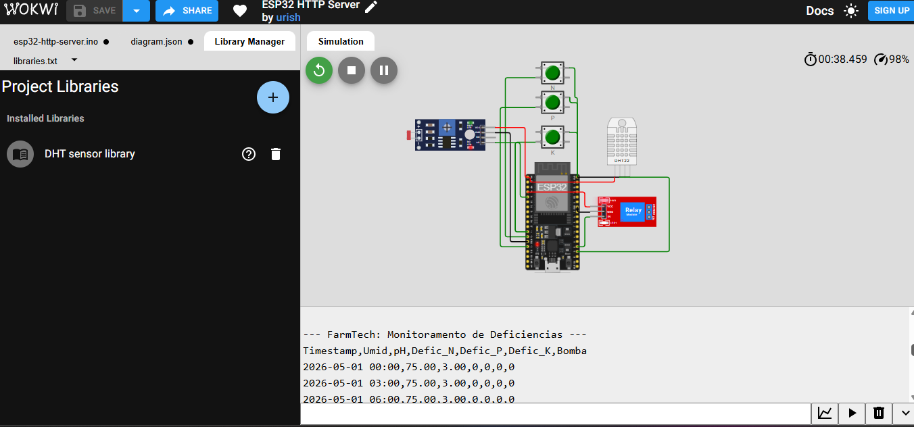
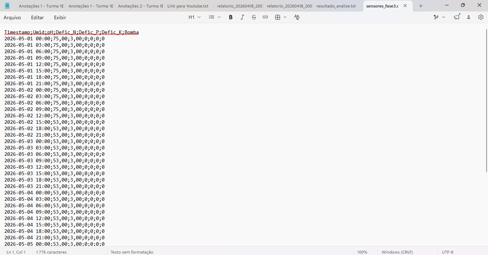
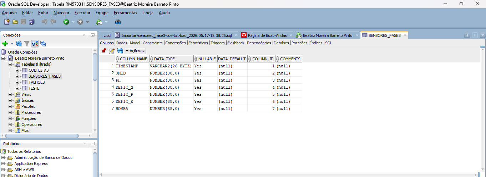
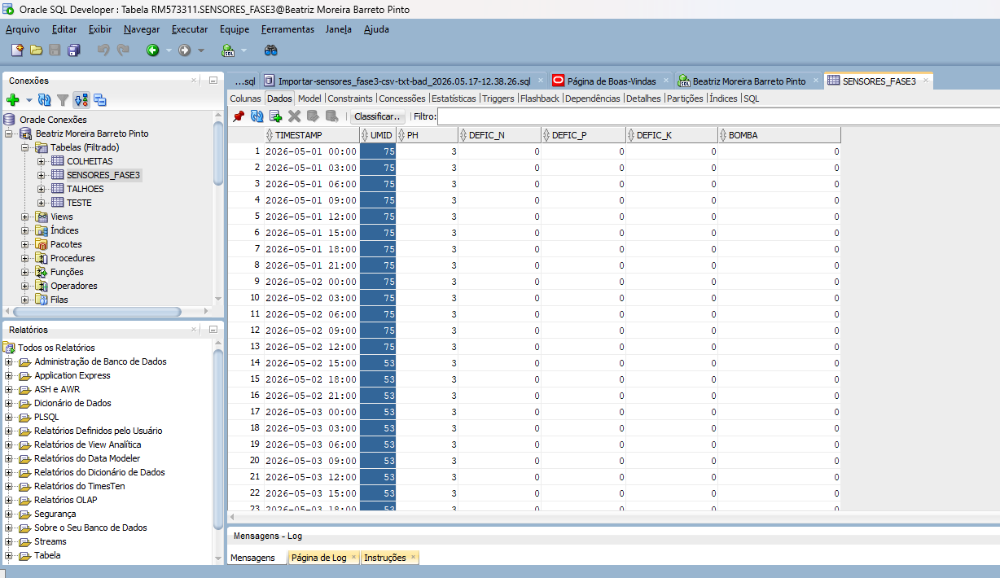
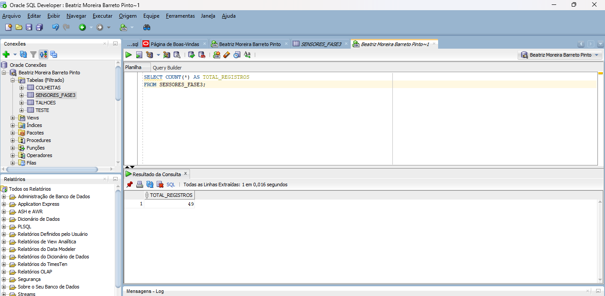
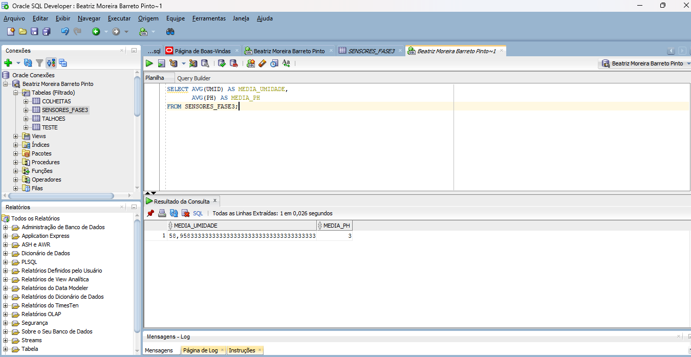
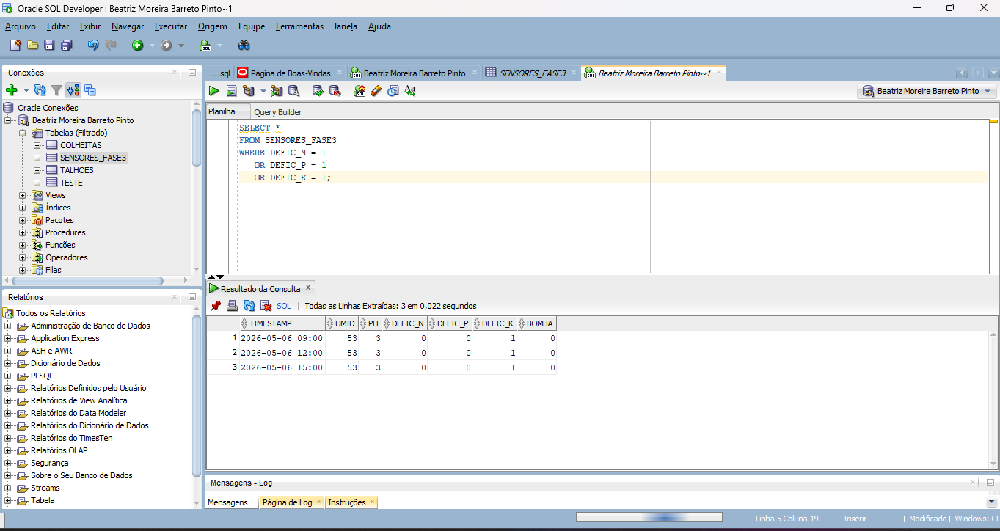

# FIAP - Faculdade de Informática e Administração Paulista

<p align="center">
  <a href="https://www.fiap.com.br/">
    
  </a>
</p>

---

# Sistema Inteligente de Irrigação e Fertirrigação

## Grupo Batch Size 5

## 👨‍🎓 Integrantes:
- <a href="https://www.linkedin.com/in/beatriz-barreto-pinto-btrz">Beatriz Moreira Barreto Pinto</a>
- <a href="https://www.linkedin.com/in/gustoliver-caldas-7a9a33350">Gustavo de Oliveira Caldas</a>
- <a href="https://www.linkedin.com/in/jfnalves">João Felipe das Neves Alves</a>
- <a href="https://www.linkedin.com/in/paulocbarreto">Paulo Oliveira</a>
- <a href="https://www.linkedin.com/in/tamiresvferreiras/">Tamires Ferreira</a>

## 👩‍🏫 Professores:
### Tutor(a)
- <a href="https://www.linkedin.com/in/nicollycrsouza">Nicolly Candida Rodrigues de Souza</a>

### Coordenador(a)
- <a href="https://www.linkedin.com/in/andregodoichiovato">André Godoi Chiovato</a>


# FarmTech Solutions – Fase 3
## Monitoramento Inteligente para Agricultura Digital com Oracle Database

---


---

# Objetivo do Projeto

O projeto FarmTech Solutions tem como objetivo desenvolver um sistema inteligente de monitoramento agrícola utilizando ESP32, sensores simulados no Wokwi e armazenamento de dados em banco Oracle.

Nesta Fase 3, os dados coletados pelos sensores foram exportados em formato CSV e posteriormente importados para um banco de dados relacional Oracle, permitindo consultas, análises e monitoramento das condições do solo e irrigação.

---

# Tecnologias Utilizadas

- ESP32
- Wokwi Simulator
- Arduino/C++
- Oracle SQL Developer
- CSV
- SQL

---

# Estrutura do Sistema

O sistema realiza:

- leitura de umidade;
- leitura simulada de pH;
- monitoramento de deficiência de Nitrogênio (N);
- monitoramento de deficiência de Fósforo (P);
- monitoramento de deficiência de Potássio (K);
- acionamento lógico da bomba de irrigação.

Os dados são enviados pelo Serial Monitor em formato CSV e posteriormente importados no Oracle Database.

---

# Código Principal do ESP32

O código foi desenvolvido em Arduino/C++ utilizando ESP32 e biblioteca DHT.

Trecho responsável pela geração dos dados em CSV:

```cpp
Serial.print(timestamp);
Serial.print(",");

Serial.print(umid);
Serial.print(",");

Serial.print(ph);
Serial.print(",");

Serial.print(deficienciaN);
Serial.print(",");

Serial.print(deficienciaP);
Serial.print(",");

Serial.print(deficienciaK);
Serial.print(",");

Serial.println(ligarBomba ? 1 : 0);
```

---

# Simulação do Circuito no Wokwi

A simulação foi realizada utilizando:

- ESP32;
- Sensor DHT22;
- Sensor LDR;
- Relé;
- Botões para simulação de deficiência NPK.

## Print da Simulação



---

# Geração dos Dados CSV

Os dados foram gerados via Serial Monitor e exportados em formato CSV para posterior importação no Oracle Database.

Exemplo de saída:

```csv
Timestamp,Umid,pH,Defic_N,Defic_P,Defic_K,Bomba
2026-05-01 00:00,75.00,3.00,0,0,0,0
2026-05-01 03:00,75.00,3.00,0,0,0,0
2026-05-01 06:00,75.00,3.00,0,0,0,0
```

## Print do CSV



---

# Importação para Oracle Database

Foi criada a tabela:

```sql
SENSORES_FASE3
```

Estrutura da tabela:

| Campo | Tipo |
|---|---|
| TIMESTAMP | VARCHAR2 |
| UMID | NUMBER |
| PH | NUMBER |
| DEFIC_N | NUMBER |
| DEFIC_P | NUMBER |
| DEFIC_K | NUMBER |
| BOMBA | NUMBER |

## Print da Estrutura da Tabela



---

# Dados Importados

Após a importação do CSV, os dados ficaram disponíveis para consulta no Oracle SQL Developer.

## Print dos Dados



---

# Consultas SQL Realizadas

## Quantidade de Registros

```sql
SELECT COUNT(*) AS TOTAL_REGISTROS
FROM SENSORES_FASE3;
```

Resultado:

- Total de registros: 49

## Print da Consulta



---

## Média de Umidade e pH

```sql
SELECT AVG(UMID) AS MEDIA_UMIDADE,
       AVG(PH) AS MEDIA_PH
FROM SENSORES_FASE3;
```

Resultado:

- Média de umidade: 58.95
- Média de pH: 3

## Print da Consulta



---

## Consulta de Deficiências NPK

```sql
SELECT *
FROM SENSORES_FASE3
WHERE DEFIC_N = 1
   OR DEFIC_P = 1
   OR DEFIC_K = 1;
```

Resultado:

- Foram encontrados registros com deficiência de Potássio (K).

## Print da Consulta



---

# Conclusão

O projeto demonstrou a integração entre IoT, sensores agrícolas e banco de dados relacional Oracle.

Foi possível:

- simular coleta de dados agrícolas;
- gerar dados estruturados em CSV;
- importar dados para Oracle Database;
- realizar consultas SQL;
- analisar indicadores do sistema de irrigação.

O projeto evidencia a aplicação de soluções tecnológicas para agricultura digital e monitoramento inteligente no agronegócio.

---

# Repositório GitHub

INSERIR LINK DO GITHUB

---

# Vídeo Demonstrativo

INSERIR LINK DO YOUTUBE NÃO LISTADO

